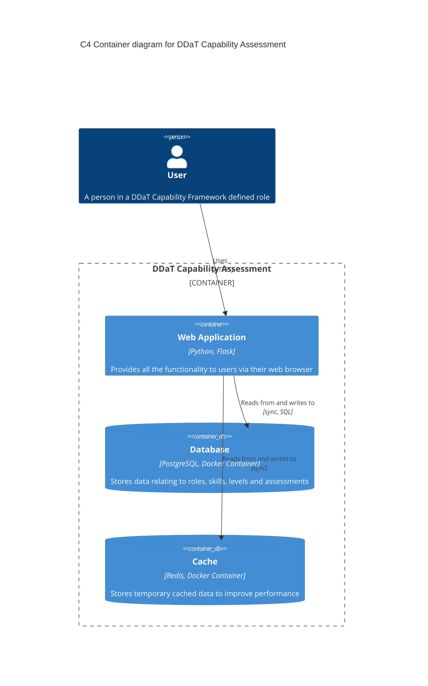
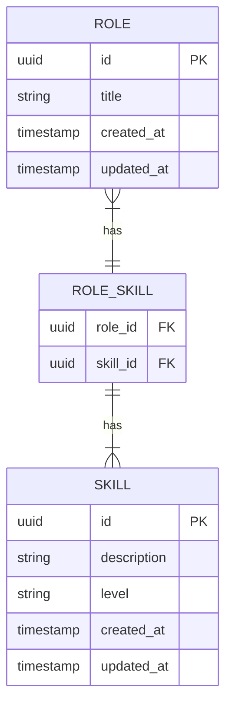

# DDaT Capability Assessment

## Prerequisites

### Required

- Docker

## Getting started

### Set local environment variables

In the `Dockerfile` file you will find a number of environment variables. These are injected as global variables into the app and pre-populated into page templates as appropriate. Enter your specific information for the following:

- CONTACT_EMAIL
- CONTACT_PHONE
- DEPARTMENT_NAME
- DEPARTMENT_URL
- SERVICE_NAME
- SERVICE_PHASE
- SERVICE_URL

### Get the latest GOV.UK Frontend assets

```shell
./build.sh
```

### Run containers

```shell
docker compose up
```

You should now have the app running on <https://localhost:8000/>.

## Testing

To run the tests:

```shell
docker compose exec web python -m pytest --cov=app --cov-report=term-missing --cov-branch
```

## Development environment



## Data model



## Contributors

- [Matt Shaw](https://github.com/matthew-shaw) (Primary maintainer)

## Support

This software is provided _"as-is"_ without warranty. Support is provided on a _"best endeavours"_ basis by the maintainers and open source community.

Please see the [contribution guidelines](CONTRIBUTING.md) for how to raise a bug report or feature request.
