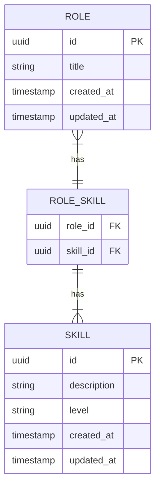

# DDaT Capability Assessment

## Prerequisites

### Required

- Python 3.8.x or higher
- PostgreSQL 14.x or higher

### Optional

- Redis 4.0.x or higher (for rate limiting, otherwise in-memory storage is used)

## Getting started

### Create local Postgres database

```shell
sudo service postgresql start
sudo su - postgres -c "create user mash with password mash"
sudo su - postgres -c "createdb capability"
sudo -u postgres psql
grant all privileges on database capability to mash;
```

### Create venv and install requirements

```shell
python3 -m venv venv
source venv/bin/activate
pip3 install -r requirements.txt ; pip3 install -r requirements_dev.txt
```

### Get GOV.UK Frontend assets

For convenience a shell script has been provided to download and extract the GOV.UK Frontend distribution assets

```shell
./build.sh
```

### Run database migrations

```shell
flask db upgrade
```

### Run app

```shell
flask run
```

You should now have the app running on <http://localhost:5000/>

## Testing

To run the tests:

```shell
python -m pytest --cov=app --cov-report=term-missing --cov-branch
```

## Data model



## Contributors

- [Matt Shaw](https://github.com/matthew-shaw) (Primary maintainer)

## Support

This software is provided _"as-is"_ without warranty. Support is provided on a _"best endeavours"_ basis by the maintainers and open source community.

Please see the [contribution guidelines](CONTRIBUTING.md) for how to raise a bug report or feature request.
